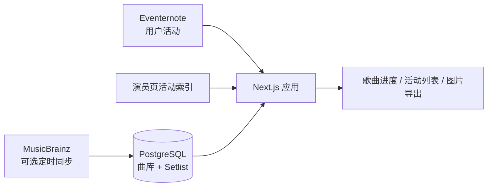

# BanG Dream! 现场听歌统计

输入 [Eventernote](https://www.eventernote.com/) 用户名，即可查看自己参加过的
BanG Dream! 现场、各乐队原创曲听歌进度，以及尚未在现场听到的歌曲。

> 本仓库是项目的开源分支。
> 欢迎通过 [Issue](https://github.com/calcxx/bandori-live-songs/issues) 反馈问题。线上站点的改动可能不会立即同步至此。

## 功能亮点

- 按乐队统计原创曲覆盖率，筛选未听歌曲、虚拟团与无歌曲活动
- 展示每场活动的 Setlist 收录状态、首次听到的歌曲与单曲演唱次数
- 通过 Eventernote 演员页活动索引识别活动归属，减少列表页出演者错位影响
- 支持简体中文、繁体中文和日语
- 支持浅色、深色及跟随系统主题，并可将统计结果导出为 JPEG
- Eventernote 用户数据使用数据库缓存，并在过期时后台静默刷新
- 管理后台支持活动浏览、Setlist/歌曲导入、屏蔽规则及用户缓存查看
- 可选的每日 MusicBrainz 同步会补充新歌并修正更早的发售日期

## 工作原理



Eventernote 提供用户参加过的活动；本地数据库维护 BanG Dream! 原创曲曲库与人工录入的
Setlist。只有已收录 Setlist 的活动才会计入「听过」。详细设计见
[ARCHITECTURE.md](ARCHITECTURE.md)。

## 快速开始

需要 Node.js 20+ 与 PostgreSQL：

```bash
cp .env.example .env.local
npm install
npm run db:migrate
npm run db:seed
npm run dev
```

打开 `http://localhost:3000`。完整的首次部署、定时任务和故障排查说明见
[docs/deployment.md](docs/deployment.md)。

## 配置

| 环境变量               | 用途                       |     必需     |
| ---------------------- | -------------------------- | :----------: |
| `DATABASE_URL`       | 应用运行时数据库连接       |      是      |
| `DIRECT_URL`         | 迁移与数据脚本使用的直连   |      是      |
| `SETLIST_IMPORT_KEY` | 管理后台密钥               |      是      |
| `CRON_SECRET`        | 保护两条定时任务接口       | 生产环境建议 |
| `DEMO_USER_ID`       | 首页未查询时展示的示例用户 |      否      |

常用检查：

```bash
npm run lint
npm run typecheck
npm run test
npm run build
```

## 你也许感兴趣的项目

### Eventernote 相关

- [Eventernote 年度总结](https://receipt.gyuni.space/)
- [Eventernote Analyzer](https://en-analyzer.2ak1.com/)

### BanG Dream! 相关

- [日本 live 远征攻略导航](https://genchi.top/)
- [邦多利资料库](https://bandori.fans/)

## 许可证

[MIT](LICENSE)
